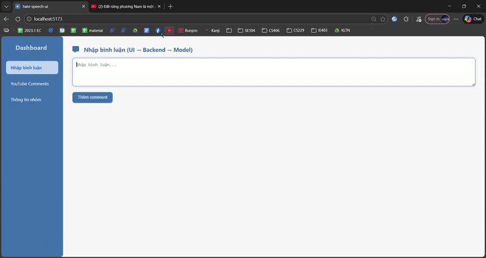

<p align="center">
  <a href="https://www.uit.edu.vn/" title="University of Information Technology" style="border: none;">
    
  </a>
</p>

<h1 align="center">HARE: Rationale-Augmented Training for Targeted Hate Speech Detection in Vietnamese Social Media</h1>

<p align="center">
  
</p>

<p align="center">
  IE403.Q11 · Social Media Mining · UIT, VNU-HCM
</p>

<p align="center">
  <a href="./LICENSE"></a>
  
  
</p>

HARE is an explainable hate speech detection framework for Vietnamese social media. It combines multi-label classification (11 classes across 5 target groups) with rationale extraction via a two-stage QLoRA pipeline on Qwen2.5-3B-Instruct, mapping evidence spans back to source text for transparent content moderation.

> [!IMPORTANT]
> This repository is structured for academic reproducibility and code inspection.
> Full runnable demo assets (model weights, LoRA adapters) are distributed via [OneDrive](https://nklod-my.sharepoint.com/:f:/g/personal/phatxinhchao_nklod_onmicrosoft_com/IgAYGfiHj2ZsTpr2aebNbSfrAVG0YJ0LkziTmToc1uIn1oY?e=nnp26c) due to storage constraints.

## Table of Contents

- [Highlights](#highlights)
- [Quick Start](#quick-start)
- [Repository Structure](#repository-structure)
- [Results](#results)
- [Demo](#demo)
- [Project Artifacts](#project-artifacts)
- [Team](#team)
- [Citation](#citation)

---

## Highlights

- **Two-stage QLoRA fine-tuning** — Stage 1 trains multi-label classification on 7,540 oversampled examples; Stage 2 continues with 1,221 CoT-rationale tuples for implicit hate pattern learning.
- **1,221 human-verified rationale tuples** — Generated via Gemini 2.0 Flash with three prompt iterations (quality: 40 → 67 → 89/100) and automatic consistency filtering (16% acceptance rate).
- **Boundary redistribution finding** — Rationale training consistently shifts predictions toward Offensive-level labels (+8.35 avg F1) while Hate-level declines (−2.64 avg F1), verified across 3 seeds with ablation controls.
- **Rationale-to-span highlighting** — Unicode-aware span mapping projects model evidence back to original text for interpretable moderation.
- **Real-time demo** — FastAPI backend + React frontend with YouTube comment stream integration.

---

## Quick Start

```bash
git clone https://github.com/paht2005/IE403.Q11_Hate-Speech-Detection-and-Highlighting-for-Vietnamese-Project.git
cd IE403.Q11_Hate-Speech-Detection-and-Highlighting-for-Vietnamese-Project

python -m venv .venv
source .venv/bin/activate   # macOS/Linux
pip install -r requirements.txt
```

Launch the experiment notebooks:

```bash
cd research/notebooks
jupyter notebook
```

> [!NOTE]
> Notebooks were originally authored for Kaggle/Google Colab paths.
> When running locally, update file paths to match the repository layout (e.g., `../../dataset/processed/dataset_rationale.json`).
> For paper revision experiments (multi-seed, ablations), see `research/notebooks/experiments/README_EXPERIMENTS.md`.

---

## Repository Structure

```text
.
├── app-preview/                    # Lightweight code preview (no weights required)
│   ├── backend-logic/              #   FastAPI routes, model wrapper, highlighting, YouTube API
│   ├── frontend-snippet/           #   HTML entry template
│   └── sample-outputs/             #   Sample inference JSONs
├── dataset/
│   ├── raw/                        #   Original ViTHSD source files (.xlsx)
│   └── processed/                  #   Annotated training data (dataset_rationale.json)
├── research/
│   ├── notebooks/                  #   Baseline & fine-tuning notebooks (Kaggle-compatible)
│   │   └── experiments/            #     Multi-seed, ablation, and analysis notebooks + outputs
│   ├── prompts/v4_final/           #   Final prompt templates (implied statement + rationale)
│   └── src/                        #   Reusable modules: config, data_preparation, models, evaluation
├── results/figures/                #   Visualizations and live-demo.gif
├── docs/                           #   Course slides (IE403.Q11-Nhom2_slide.pdf)
├── MAPR2026/                       #   Paper manuscript (for_review.pdf)
└── requirements.txt
```

---

## Results

Multi-seed evaluation (seeds 42, 123, 456) on ViTHSD test set (1,800 samples). HARE and Vanilla are mean ± std; baselines are single-run.

| Model | Precision | Recall | F1-Micro | F1-Macro |
|---|---:|---:|---:|---:|
| BiGRU-LSTM-CNN | 0.4198 | **0.6798** | 0.5191 | 0.3190 |
| PhoBERT-base | 0.5620 | 0.5310 | 0.5412 | 0.2586 |
| Flan-T5-base | 0.4810 | 0.4520 | 0.4684 | 0.1311 |
| Qwen2.5 Vanilla (Stage 1) | **0.6102 ± 0.017** | 0.5843 ± 0.022 | **0.5967 ± 0.013** | 0.3295 ± 0.016 |
| **HARE (proposed)** | 0.5091 ± 0.027 | 0.6111 ± 0.011 | 0.5551 ± 0.016 | **0.3570 ± 0.044** |

> [!NOTE]
> HARE trades F1-Micro for higher Recall and F1-Macro. The primary finding is a per-label **boundary redistribution**: +8.35 avg F1 on Offensive-level labels, −2.64 on Hate-level — consistent across all three seeds.

---

## Demo

<p align="center">
  
</p>

The full demo (FastAPI backend + React frontend) is distributed as an external package. Preview API routes available in `app-preview/backend-logic/`:

| Method | Route | Description |
|---|---|---|
| `GET` | `/health` | Health check |
| `POST` | `/v1/analyze` | Single comment inference |
| `POST` | `/v1/analyze/batch` | Batch inference |
| `GET` | `/v1/youtube/comments` | Fetch and analyze YouTube comments |

> [!CAUTION]
> End-to-end inference requires model assets (LoRA adapters, tokenizer, hate keywords).
> Download the full demo package from [OneDrive](https://nklod-my.sharepoint.com/:f:/g/personal/phatxinhchao_nklod_onmicrosoft_com/IgAYGfiHj2ZsTpr2aebNbSfrAVG0YJ0LkziTmToc1uIn1oY?e=nnp26c).

---

## Project Artifacts

| Artifact | Location |
|---|---|
| Live demo | `results/figures/live-demo.gif` |
| Sample outputs | `app-preview/sample-outputs/results_datasetA_qwen_stage2.json` |
| Experiment results | `research/notebooks/experiments/outputs/` |
| Course slides | `docs/IE403.Q11-Nhom2_slide.pdf` |
| Paper manuscript | `MAPR2026/for_review.pdf` |
| Full demo package | [OneDrive](https://nklod-my.sharepoint.com/:f:/g/personal/phatxinhchao_nklod_onmicrosoft_com/IgAYGfiHj2ZsTpr2aebNbSfrAVG0YJ0LkziTmToc1uIn1oY?e=nnp26c) |

---

## Team

| No. | Student ID | Full Name | Role | GitHub |
|---:|:---:|---|---|---|
| 1 | 23521143 | Phat Nguyen Cong | Leader | [paht2005](https://github.com/paht2005) |
| 2 | 23520032 | An Truong Hoang Thanh | Member | [Awnpz](https://github.com/Awnpz) |
| 3 | 23520023 | An Nguyen Xuan | Member | [annx-uit](https://github.com/annx-uit) |
| 4 | 23520158 | Binh Mai Thai | Member | [maibinhkznk209](https://github.com/maibinhkznk209/) |
| 5 | 21520255 | Huong Nguyen Le Quynh | Member | [tracycute](https://github.com/tracycute) |

---

## Citation

If this repository supports your research or coursework, please cite the project repository and the associated IE403 report/paper artifacts.
